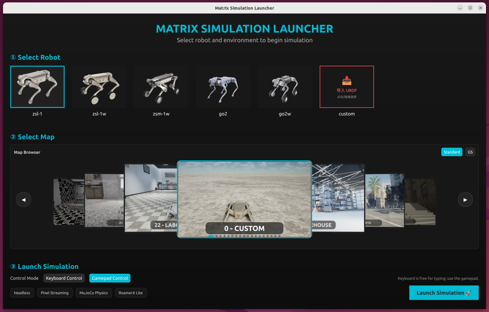

# MATRiX

<div align="center">
  <a href="#">
    
  </a>
</div>

<div align="center">

[](README.md)
[](docs/README_CN.md)

</div>

> **Last Updated:** 2026-07-20

MATRiX is an advanced simulation platform that integrates **MuJoCo**, **Unreal Engine 5**, and **CARLA** to provide high-fidelity, interactive environments for quadruped robot research. Its software-in-the-loop architecture enables realistic physics, immersive visuals, and optimized sim-to-real transfer for robotics development and deployment.

## 🚀 Quick Start

### 1. Environment Dependencies
- **OS:** Ubuntu 22.04
- **GPU:** NVIDIA RTX 4060 or above (Driver >= 535)
- **Tools:** GCC/G++ ≥ C++11, CMake ≥ 3.16
- **ROS:** `ROS_humble`

### 2. Installation
```bash
# Clone
git clone https://github.com/zsibot/matrix.git
cd matrix

# Install system/runtime dependencies, including required local deb packages in deps/.
# The script configures the ROS 2 Humble apt source automatically if it is missing.
bash scripts/install_deps.sh

# Install release assets (base package, runtime assets, shared resources, and selected maps)
bash scripts/release_manager/install_chunks.sh

# Verify after dependencies and assets are installed
bash scripts/check_env.sh runtime
```
*`scripts/run_sim.sh` and `scripts/run_custom_urdf.sh` run runtime environment checks automatically before launch.*
*If the ROS apt source is blocked, rerun with `ROS_APT_REPO_URL=<reachable-ros2-apt-mirror> bash scripts/install_deps.sh`.*
*If your network hits aria2/wget TLS errors, rerun the chunk installer with `SKIP_ARIA2=1` to force the fallback download path.*
*Full offline package: [matrix_0.1.2.zip (Artifactory)](http://192.168.50.40:8081/artifactory/jszrsim/github/matrix_0.1.2.zip) / [Google Drive](https://drive.google.com/file/d/1d4q28AgSwmfv7x07oE-YF8xVOdSva9ll/view?usp=drive_link) / [Baidu Netdisk, code: `jbk3`](https://pan.baidu.com/s/12k5XJwD53ax3we3_1Gulmw?pwd=jbk3).*
*See [Chunk Packages Guide](docs/CHUNK_PACKAGES_GUIDE.md) for offline/manual installation.*

### 3. Run Simulation
```bash
./bin/sim_launcher
```
*(Select your robot and map in the launcher interface.)*

<div align="center">
  
</div>

> 🇨🇳 **要在新环境跑「仿真 + 完整 TF 树」的完整工作流？** 见下方
> [新环境运行仿真完整流程（中文）](#-新环境运行仿真完整流程中文)。

## 🧭 新环境运行仿真完整流程（中文）

本节记录在一台**全新机器**上，从零把仿真跑起来、拿到完整 TF 树的完整步骤。上游的
`./bin/sim_launcher` 只负责启动仿真本体；本节的 `scripts/run_sim_with_tf.sh` 在其
之上补齐 TF、关节反馈、深度时间戳修复与 `/cmd_vel` 行走，是日常研发/建图实际使用的入口。

### 0. 前置：系统与依赖

- **系统**：Ubuntu 22.04；**ROS**：Humble；**GPU**：NVIDIA RTX 4060 以上（驱动 ≥ 535）。
- 先按上方 [Installation](#2-installation) 装好系统依赖与仿真资源：

  ```bash
  bash scripts/install_deps.sh              # 系统/运行时依赖 + deps/ 里的本地 deb
  bash scripts/release_manager/install_chunks.sh   # 仿真资源（base 包、地图等）
  bash scripts/check_env.sh runtime         # 验证依赖与资源到位
  ```

- 额外需要 eCAL 开发库、protobuf，以及 `/usr/include/robot_sdk.pb.h`、
  `/usr/lib/librobot_sdk.so`（`install_deps.sh` 已包含；缺失会导致下一步 eCAL 桥编译失败）。

### 1. 关键：设置 ROS 中间件环境变量（最容易漏！）

仿真通过 **CycloneDDS + `ROS_DOMAIN_ID=89`** 通信。新环境若不设置，
`ros2 topic list` 会**完全为空**、SLAM 也收不到任何数据。把下面两行写进 `~/.bashrc`
（或每个终端手动 `export`）：

```bash
source /opt/ros/humble/setup.bash
export RMW_IMPLEMENTATION=rmw_cyclonedds_cpp
export ROS_DOMAIN_ID=89
```

> ⚠️ 不要改用 zenoh：本仿真运行时是 `rmw_cyclonedds_cpp` + domain 89。

### 2. 构建 eCAL ↔ ROS 桥与工具

`run_sim_with_tf.sh` 依赖若干本地编译的 C++ 工具（eCAL 关节桥、`/cmd_vel` 桥等）。
首次在新环境需构建一次（脚本首启时若缺 `mujoco_joint_bridge` 也会自动构建）：

```bash
bash scripts/build_joint_bridge.sh
# 产物 -> scripts/bin/: mujoco_joint_bridge, mujoco_state_probe,
#                       cmd_vel_ecal_bridge, find_walk_mode
```

### 3. 启动仿真本体

先用上游启动器把仿真拉起来（选机器人与地图）：

```bash
./bin/sim_launcher          # 交互式选择；或直接命令行：
bash scripts/run_sim.sh xgb 13     # 机器人 xgb + 场景 13 (OfficeWorld)
```

- 机器人：`xgb`(默认) / `xgw` / `zgws` / `go2` / `go2w`（腿/传感器 TF 需 URDF，仅 `xgb`/`xgw` 有）。
- 常用场景 ID：`1`=SceneWorld、`13`=OfficeWorld（室内建图推荐）、`3`=YardWorld，完整列表见
  [Robots_and_Maps_CN.md](docs/Robots_and_Maps_CN.md)。

### 4. 启动 TF 树 + 传感器/修复节点

**另开一个终端**（确认已按第 1 步设好环境变量），把 TF 栈挂到已运行的仿真上：

```bash
cd ~/software/matrix
bash scripts/run_sim_with_tf.sh xgb 13
```

该脚本默认 `ATTACH=1`（**挂接已运行的仿真，不自己起 sim**），会启动：

1. `odom_to_tf`：`odom → base_link`（保留完整 roll/pitch）；
2. `rsp.launch.py`：`robot_state_publisher` + base_link 桥 + eCAL 真实关节角 + `base_footprint` + 传感器静态 TF；
3. `depth_image_fixup`：修复仿真深度图头部并**将时间戳提前 ~134ms**（消除深度点云旋转重影）；
4. `cmd_vel` 桥：`/cmd_vel → eCAL sdk_cmd`（默认 OBSERVE，不发命令，见第 5 节）。

验证 TF 与话题：

```bash
ros2 topic list | grep -E 'livox|odom|joint_states|front_depth'
ros2 run tf2_tools view_frames        # 应看到 odom -> base_link -> BASE_LINK -> {腿/脚, 传感器}
```

> 一键起 sim + TF：设 `ATTACH=0 MUJOCO=1 bash scripts/run_sim_with_tf.sh xgb 13`
> 会连仿真一起拉起，并打开 MuJoCo 键盘控制窗口（U=站立，WASD=移动）。

### 5. 让机器人行走（`/cmd_vel`）

出于安全，`/cmd_vel` 速度控制**默认关闭**（OBSERVE，只打印不下发）。要真正驱动机器人：

1. 先让机器人**站立**（MuJoCo 窗口按 `U`）；
2. 用 `CMD_CONTROL_MODE=18 CMD_MOTION_MODE=1` 启动（`18`=RL_MIX 平移行走）：

   ```bash
   CMD_CONTROL_MODE=18 CMD_MOTION_MODE=1 bash scripts/run_sim_with_tf.sh xgb 13
   # 然后发速度指令：
   ros2 topic pub /cmd_vel geometry_msgs/msg/Twist '{linear: {x: 0.3}, angular: {z: 0.0}}'
   ```

> 模式对照（SDK 路径）：`stand=1/10`、**`WALK=18/1`**、`balance-stand/RPY=21/100`（原地机身姿态，**不是**行走）。
> 步态由 RL 策略按指令速度自然涌现，无独立 trot/fly-trot 模式号；`x` 方向上限约 3 m/s。

### 6. 深度图时间戳修正节点使用说明

仿真给深度图打的 header 时间戳**晚于真实成像时刻**，会导致深度点云在运动（尤其旋转）
时相对 TF 错位、产生拖影。`depth_image_fixup` 负责修正，**默认已由
`run_sim_with_tf.sh` 自动启动**，无需手动运行；下面说明其用法，供单独调试或换主机重测。

#### `depth_image_fixup.py` — 深度图修复 + 时间戳提前

一并修好仿真深度图的三个问题：① header 的 height/width/step=0；② 缺失的
CameraInfo；③ 时间戳滞后。默认输出 `/front_depth/image` + `/front_depth/camera_info`。

- **在 `run_sim_with_tf.sh` 中**：由 `rsp.launch.py` 启动，默认 `stamp_offset_ms:=134`。
  用 `depth_fixup:=false` 可关闭（`ros2 launch scripts/rsp.launch.py ... depth_fixup:=false`）。
- **单独运行**：

  ```bash
  python3 scripts/depth_image_fixup.py --ros-args \
    -p in_topic:=/image_raw/compressed/depth \
    -p out_topic:=/front_depth/image \
    -p frame_id:=front_optical \
    -p config_path:=config/config.json \
    -p stamp_offset_ms:=134.0
  ```

- 常用参数：

  | 参数 | 默认 | 说明 |
  |---|---|---|
  | `in_topic` | `/image_raw/compressed/depth` | 输入深度图话题 |
  | `out_topic` | `/front_depth/image` | 修复后输出 |
  | `stamp_offset_ms` | `0.0`（脚本里传 `134.0`）| 时间戳**提前**量（ms），消除深度旋转拖影 |
  | `frame_id` | `front_optical` | 输出 frame（`""`=保持原样）|
  | `config_path` | `config/config.json` | 从中读分辨率/FOV 合成 CameraInfo |
  | `publish_camera_info` | `true` | 是否合成并发布 RGB/深度 CameraInfo |

#### 用探针校准偏移量（换主机 / 渲染负载变化时）

深度的 `stamp_offset_ms`（默认 134）是**特定主机 + 渲染负载**下测得的，换机器需重测。
对应探针：

```bash
# 深度：对着一面墙旋转，读 delta*
python3 scripts/depth_latency_probe.py --ros-args \
  -p depth_topic:=/front_depth/image -p info_topic:=/front_depth/camera_info \
  -p optical_frame:=front_optical -p odom_frame:=odom \
  -p delta_max_ms:=150.0 -p delta_step_ms:=2.0 -p min_omega:=0.15 -p window_sec:=6.0
```

> **测原始延迟时，先把 `depth_image_fixup` 的 `stamp_offset_ms` 设为 0**（否则偏移已被补进时间戳，
> 探针只会报残差）。把测得的 `delta*` 填回深度 `stamp_offset_ms` 即可。
> 修正后对输出话题（`/front_depth/image`）再测一次应得 `delta*≈0` = 补偿到位。

### 7. 停止

在 `run_sim_with_tf.sh` 的终端按 `Ctrl-C`：默认（`ATTACH=1`）只停 TF 栈，**保留仿真**；
`ATTACH=0` 时会连仿真一起停。

### 常见问题排查

| 现象 | 原因 / 处理 |
|---|---|
| `ros2 topic list` 为空 | 未设 `ROS_DOMAIN_ID=89` / `RMW_IMPLEMENTATION=rmw_cyclonedds_cpp`（第 1 步）|
| 深度点云旋转拖影 | `depth_image_fixup` 的 `stamp_offset_ms`（默认 134）需按主机重测 |
| 深度掉帧/点云稀疏 | 内核 UDP 缓冲过小：`sudo sysctl -w net.core.rmem_max=67108864 net.core.wmem_max=67108864` 后重启 |
| 发 `/cmd_vel` 机器人不动 | 未先站立（按 `U`），或未设 `CMD_CONTROL_MODE=18`（默认 OBSERVE 不下发）|
| eCAL 桥编译失败 | 缺 eCAL 开发库 / `robot_sdk`；重跑 `install_deps.sh` 后再 `build_joint_bridge.sh` |

## 📚 Documentation Directory

To keep this README concise, detailed guides have been organized into the `docs/` folder:

**Basics & Setup**
- [📦 Chunk Packages Guide](docs/CHUNK_PACKAGES_GUIDE.md) - Modular package deployment & offline install
- [🎮 Controller Guide](docs/Controller_Guide.md) - Gamepad & Keyboard control mappings
- [🛠️ Scripts Guide](docs/Scripts_Guide.md) - Detailed CLI scripts usage

**Simulation & Customization**
- [🤖 Robot Types & Maps](docs/Robots_and_Maps.md) - IDs and visual previews of all robots and maps
- [⚙️ Sensor Configuration](docs/Sensor_Config_Tutorial.md) - Adjusting cameras, LiDAR, and RViz visualization
- [🌍 Custom Scene Guide](docs/Custom_Scene_Tutorial.md) - Building custom JSON-based environments
- [🐕 Custom Robot Tutorial](docs/Custom_Robot_Tutorial.md) - Importing your own MuJoCo URDF models

**Advanced Features**
- [🌐 Multi-Robot Tutorial](docs/Multi_Robot_Tutorial.md) - Simulating multiple robots simultaneously
- [🐳 Docker Tutorial](docs/Docker_Tutorial.md) - Running MATRiX in a container
- [📡 RoamerX Open Integration](docs/RoamerX_Lite_Integration.md) - ROS2 Nav2 stack integration
- [🎥 Pixel Streaming](docs/pixelstreaming_tutorial.md) - Web browser streaming

## 💬 Community

**Add the GENISOM AI WeChat assistant for MATRiX simulation discussions and support:**

<div align="center">
  
  <p><em>Scan to add XinQi Robo; mention MATRiX to join the simulation community.</em></p>
</div>

## 🤝 Contributing

Bug reports, documentation improvements, and runtime tooling changes are
welcome. Start with [CONTRIBUTING.md](CONTRIBUTING.md), and review the
[architecture and maintainer guide](docs/MAINTAINER_GUIDE.md) before changing
launch or release scripts. Security issues should follow [SECURITY.md](SECURITY.md)
rather than being filed as public issues.

## 🙏 Acknowledgements

This project builds upon the incredible work of the following open-source projects:

- [MuJoCo-Unreal-Engine-Plugin](https://github.com/oneclicklabs/MuJoCo-Unreal-Engine-Plugin)
- [MuJoCo](https://github.com/google-deepmind/mujoco)
- [Unreal Engine](https://github.com/EpicGames/UnrealEngine)
- [CARLA](https://carla.org/)
