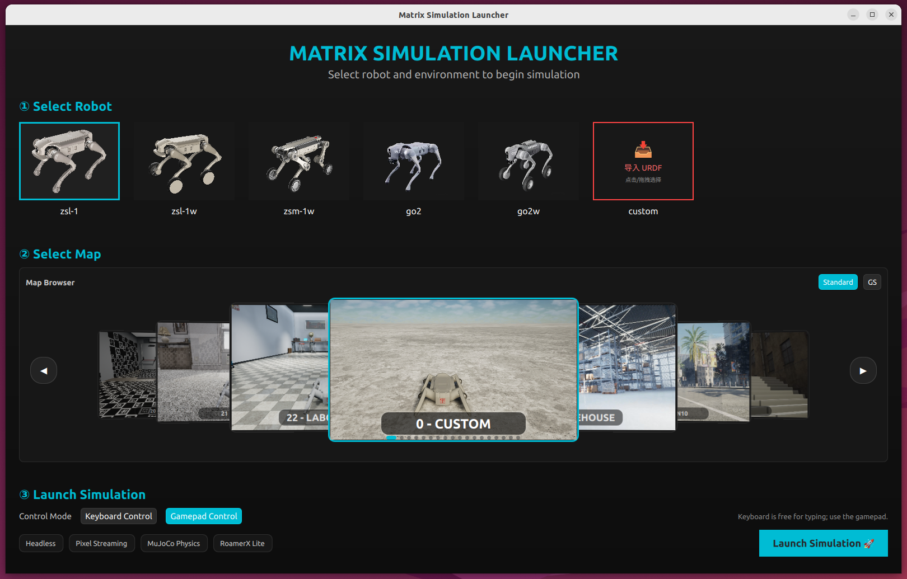

# MATRiX

<div align="center">
  <a href="#">
    
  </a>
</div>

<div align="center">

[](../README.md)
[](README_CN.md)

</div>

> **最后更新：** 2026-04-28

MATRiX 是一个集成了 **MuJoCo**、**Unreal Engine 5** 和 **CARLA** 的高级仿真平台，提供用于四足机器人研究的高保真、交互式环境。其软件在环（software-in-the-loop）架构支持真实物理仿真、沉浸式视觉效果，并优化了仿真到现实的迁移（sim-to-real）以便机器人开发与部署。

## 🚀 快速开始

### 1. 环境依赖
- **操作系统：** Ubuntu 22.04
- **推荐 GPU：** NVIDIA RTX 4060 或更高 (建议驱动 >= 535)
- **构建环境：** GCC/G++ ≥ C++11, CMake ≥ 3.16
- **ROS 依赖：** `ROS_humble`

### 2. 安装
```bash
# 克隆仓库
git clone https://github.com/zsibot/matrix.git
cd matrix

# 安装系统/运行时依赖，包括 deps/ 下必需的本地 deb 包。
# 如果系统没有 ROS 2 Humble apt 源，脚本会自动配置。
bash scripts/install_deps.sh

# 安装 release 资源分块包（base、runtime assets、shared 和选择的地图）
bash scripts/release_manager/install_chunks.sh 0.1.2

# 依赖和资源安装完成后再检查运行时环境
bash scripts/check_env.sh runtime
```
*`scripts/run_sim.sh` 和 `scripts/run_custom_urdf.sh` 在启动前会自动执行运行时环境检查。*
*如果 ROS apt 源访问受限，可使用 `ROS_APT_REPO_URL=<可访问的ros2 apt镜像> bash scripts/install_deps.sh` 指定镜像后重试。*
*如果网络环境下 aria2/wget 出现 TLS 错误，可使用 `SKIP_ARIA2=1 bash scripts/release_manager/install_chunks.sh 0.1.2` 强制走备用下载路径。*
*完整离线包：[matrix_0.1.2.zip（Artifactory）](http://192.168.50.40:8081/artifactory/jszrsim/github/matrix_0.1.2.zip) / [Google Drive](https://drive.google.com/file/d/1d4q28AgSwmfv7x07oE-YF8xVOdSva9ll/view?usp=drive_link) / [百度网盘，提取码：`jbk3`](https://pan.baidu.com/s/12k5XJwD53ax3we3_1Gulmw?pwd=jbk3)。*
*无法访问 GitHub？请参阅 [Chunk Packages 使用指南](CHUNK_PACKAGES_GUIDE_CN.md) 了解离线手动安装方法。*

### 3. 运行仿真
```bash
./bin/sim_launcher
```
*(在启动器界面选择机器人型号与地图场景)*

<div align="center">
  
</div>

## 📚 文档导航

为了保持主 README 的简洁，所有详细指南均已归档至 `docs/` 目录：

**基础与设置**
- [📦 分块包部署指南](CHUNK_PACKAGES_GUIDE_CN.md) - 模块化打包部署与离线安装说明
- [🎮 遥控器说明](Controller_Guide_CN.md) - 手柄与键盘控制快捷键映射
- [🛠️ 脚本使用指南](Scripts_Guide_CN.md) - 构建、运行与发布脚本的详细说明

**仿真与自定义**
- [🤖 机器人与地图参考](Robots_and_Maps_CN.md) - 所有支持的机器人型号和地图场景图文说明
- [⚙️ 传感器配置教程](Sensor_Config_Tutorial.md) - 调整相机、雷达及 RViz 数据可视化
- [🌍 自定义场景指南](Custom_Scene_Tutorial_CN.md) - 通过 JSON 文件构建自定义测试环境
- [🐕 自定义机器人教程](Custom_Robot_Tutorial.md) - 导入和集成第三方 MuJoCo 机器人模型

**高级功能**
- [🌐 多机器人仿真](Multi_Robot_Tutorial.md) - 在同一场景中配置和控制多个机器人
- [🐳 Docker 使用指南](Docker_Tutorial.md) - 在带 GPU 加速的容器中运行仿真
- [📡 导航栈集成适配](RoamerX_Lite_Integration.md) - 接入 GENISOM RoamerX Open (ROS2 Nav2) 框架
- [🎥 像素流 (Pixel Streaming)](pixelstreaming_tutorial.md) - 网页端远程实时查看仿真画面

## 💬 交流社区

**加入我们的微信群,参与 MATRiX 仿真交流:**

<div align="center">
  
  <p><em>扫码加入 MATRiX 仿真交流群</em></p>
</div>

## 🙏 致谢

本项目基于以下开源项目的出色工作构建：

- [MuJoCo-Unreal-Engine-Plugin](https://github.com/oneclicklabs/MuJoCo-Unreal-Engine-Plugin)
- [MuJoCo](https://github.com/google-deepmind/mujoco)
- [Unreal Engine](https://github.com/EpicGames/UnrealEngine)
- [CARLA](https://carla.org/)
