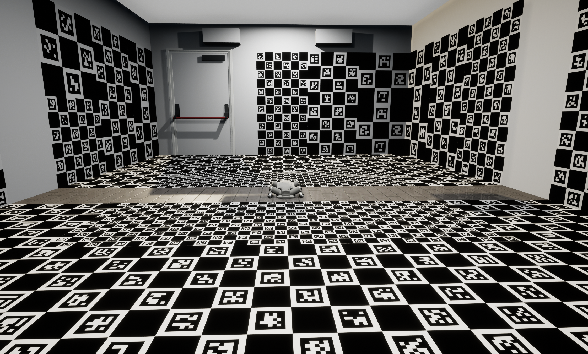
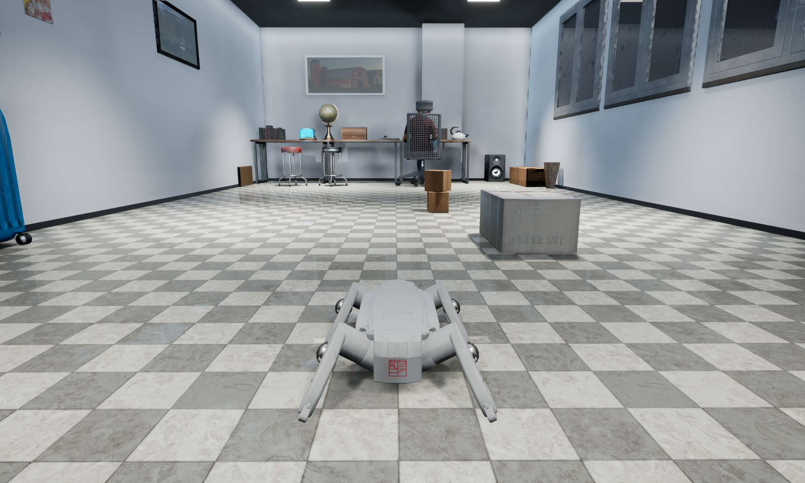

# 机器人类型与地图选择

## 机器人类型选择

| 机器人 ID | 机器人类型 | 说明 |
|----------|------------|-------------|
| 1        | xgb (XG)   | 标准四足机器人 (XGB) |
| 2        | xgw (XGW)  | 轮足机器人 (XGW) |
| 3        | zgws (ZGWS)| 中型四足机器人 (ZGWS) |
| 4        | go2 (GO2)  | Unitree Go2 四足机器人 |
| 5        | go2w (GO2W)| Unitree Go2 轮足机器人 |

---
## xgb (XG) - 机器人 ID: 1
<h1 title="xgb (XG)">
    
</h1>

## xgw (XGW) - 机器人 ID: 2
<h1 title="xgw (XGW)">
    
</h1>

## zgws (ZGWS) - 机器人 ID: 3
<h1 title="zgws (ZGWS)">
    
</h1>

## go2 (GO2) - 机器人 ID: 4
<h1 title="go2 (GO2)">
    
</h1>

## go2w (GO2W) - 机器人 ID: 5
<h1 title="go2w (GO2W)">
    
</h1>

## 地图选择

| 地图 ID | 地图名称     | 说明 |
|--------|--------------|-------------|
| 0      | CustomWorld  | 自定义地图 |
| 1      | Warehouse    | 仓库场景 (SceneWorld) |
| 2      | Town10World  | 城镇场景 |
| 3      | YardWorld    | 庭院场景 |
| 4      | CrowdWorld   | 人群场景，包含 50 个随机行走的行人和障碍物 |
| 5      | VeniceWorld  | 威尼斯风格城镇，包含河流、桥梁和走廊 |
| 6      | HouseWorld   | 三居室公寓场景 |
| 7      | RunningWorld | 收集金币游戏 |
| 8      | Town10Zombie | 僵尸游戏 |
| 9      | IROSFlatWorld | IROS 比赛地图 1 (平地) |
| 10     | IROSSlopedWorld | IROS 比赛地图 2 (斜坡) |
| 11     | IROSFlatWorld2025 | IROS 比赛地图 3 (2025 平地) |
| 12     | IROSSloppedWorld2025 | IROS 比赛地图 4 (2025 斜坡) |
| 13     | OfficeWorld  | 两层办公楼场景 |
| 14     | 3DGSWorld    | 3D 高斯泼溅重建地图 |
| 15     | MoonWorld    | 月球表面仿真地图，动态地面 |
| 20     | Cali Room    | 标定室地图 |
| 21     | Home         | 家居地图 |
| 22     | Laboratory   | 实验室地图 |

---

## CustomWorld Map (ID: 0)
<h1 title="CustomWorld Map">
    
</h1>

## Warehouse Map (ID: 1) - SceneWorld
<h1 title="Warehouse Map">
    
</h1>

## Town10World Map (ID: 2)
<h1 title="Town10World Map">
    
</h1>

## YardWorld Map (ID: 3)
<h1 title="YardWorld Map">
    
</h1>

## CrowdWorld Map (ID: 4)
<h1 title="CrowdWorld Map">
    
</h1>

## VeniceWorld Map (ID: 5)
<h1 title="VeniceWorld Map">
    
</h1>

## HouseWorld Map (ID: 6)
<h1 title="HouseWorld Map">
    
</h1>

## RunningWorld Map (ID: 7)
<h1 title="RunningWorld Map">
    
</h1>

## Town10Zombie Map (ID: 8)
<h1 title="Town10Zombie Map">
    
</h1>

## IROSFlatWorld Map (ID: 9)
<h1 title="IROSFlatWorld Map">
    
</h1>

## IROSSlopedWorld Map (ID: 10)
<h1 title="IROSSlopedWorld Map">
    
</h1>

## IROSFlatWorld2025 Map (ID: 11)
<h1 title="IROSFlatWorld2025 Map">
    
</h1>

## IROSSloppedWorld2025 Map (ID: 12)
<h1 title="IROSSloppedWorld2025 Map">
    
</h1>

## OfficeWorld Map (ID: 13)
<h1 title="OfficeWorld Map">
    
</h1>

## 3DGSWorld Map (ID: 14)
<h1 title="3DGSWorld Map">
    
</h1>

## MoonWorld Map (ID: 15)
<h1 title="MoonWorld Map">
    
</h1>

## Calibration Room Map (ID: 20)
<h1 title="Calibration Room Map">
    
</h1>

## Home Map (ID: 21)
<h1 title="Home Map">
    
</h1>

## Laboratory Map (ID: 22)
<h1 title="Laboratory Map">
    
</h1>
